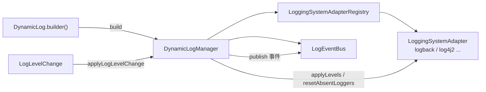

# 核心概念

Dynamic Log 的核心可以概括为：把日志系统抽象为**适配器**，把一次级别变更封装为 **LogLevelChange**，由 **DynamicLogManager** 门面统一应用，并通过 **DynamicLog 构建器**把这些组件装配到一起。



## DynamicLogManager 门面

`DynamicLogManager` 是框架的统一入口（外观模式），协调适配器注册表、事件总线与插件管理器：

```java
public class DynamicLogManager {
    // 使用默认适配器应用一批级别变更
    void applyLogLevelChange(LogLevelChange change);
    // 使用指定适配器应用（adapterName 为 null 表示默认）
    void applyLogLevelChange(LogLevelChange change, String adapterName);

    // 复位所有日志级别（ROOT 除外）
    void resetAllLogLevels();
    void resetAllLogLevels(String adapterName);

    LoggingSystemAdapterRegistry getAdapterRegistry();
    LogEventBus getEventBus();
    PluginManager getPluginManager();
}
```

`applyLogLevelChange` 的执行流程：

1. 变更为空则直接跳过；
2. 解析目标适配器（指定名或默认适配器）；
3. 发布 `LOG_LEVEL_CHANGE` 事件（变更前）；
4. `adapter.applyLevels(change.getLevelMap())` 应用级别，再 `adapter.resetAbsentLoggers(...)` 把**不在本次变更集合内**的 logger 复位为继承父级（ROOT 除外）；
5. 成功发布 `LOG_LEVEL_CHANGED`，失败发布 `ERROR` 并向上抛出。

::: tip 「声明式」应用
`applyLogLevelChange` 会把本次变更视作**期望的完整级别集合**：不在集合内的 logger 会被复位。因此每次刷新都从配置中心读取全部 `logging.level.*`，保证「配置里删掉的项也会随之还原」。
:::

## LogLevelChange 级别变更

`LogLevelChange` 是一次级别变更的不可变载体，通过 Builder 构造：

```java
LogLevelChange change = LogLevelChange.builder()
        .putLevel("com.example", "DEBUG")           // 单条
        .putAllLevels(Collections.singletonMap(     // 批量
                "com.example.service", "INFO"))
        .build();

Map<String, String> levels = change.getLevelMap(); // 不可变视图
long ts = change.getTimestamp();                    // 构造时间戳
boolean empty = change.isEmpty();
```

- `levelMap`：logger 名 → 级别字符串（`DEBUG` / `INFO` / `WARN` …）。
- 构造后不可变（内部对入参做防御性拷贝）。

## LoggingSystemAdapter 适配器

适配器（策略模式）把 Dynamic Log 适配到具体日志系统，屏蔽各家 API 差异：

```java
public interface LoggingSystemAdapter {
    String getName();                                  // 如 "logback"
    void setLogLevel(String loggerName, String level); // level 为 null 表示复位
    String getLogLevel(String loggerName);
    Collection<String> getLoggerNames();
    void resetLogLevel(String loggerName);             // 复位为继承父级

    // 默认实现：逐条 setLogLevel
    default void applyLevels(Map<String, String> levelMap) { ... }
    // 默认实现：复位不在 exclude 集合内的 logger（ROOT 除外）
    default void resetAbsentLoggers(Collection<String> excludeLoggerNames) { ... }
}
```

内置 `LogbackSpringAdapter` 适配 Logback；扩展其他系统只需实现该接口。详见 [日志系统适配器](/guide/adapter)。

## 适配器注册表

多个适配器由 `LoggingSystemAdapterRegistry` 管理，并指定其一为默认：

```java
public interface LoggingSystemAdapterRegistry {
    void register(LoggingSystemAdapter adapter);
    LoggingSystemAdapter getAdapter(String name);
    LoggingSystemAdapter getDefaultAdapter();
    void setDefaultAdapter(String name);
    boolean contains(String name);
    // ...
}
```

`DynamicLogManager` 在应用变更时，会按 `adapterName`（或默认）从注册表解析出目标适配器。

## 构建 DynamicLogManager

非 Spring 环境用 `DynamicLog` 构建器（建造者模式）装配组件：

```java
DynamicLogManager manager = DynamicLog.builder()
        .adapter(new LogbackSpringAdapter(loggingSystem)) // 可多次调用注册多个适配器
        .defaultAdapter("logback")                        // 指定默认适配器
        .eventBus(new DefaultLogEventBus())               // 可选，默认已提供
        .refresher(myRefresher)                           // 可选，构建时自动 start()
        .build();
```

`build()` 会注册全部适配器、设置默认适配器、创建 `DynamicLogManager`，并启动所有刷新器。Spring Boot 环境下这些都由自动配置完成，无需手写，详见 [Spring Boot 接入](/guide/springboot)。

## 事件与插件

- **事件**：级别变更、适配器注册、刷新器启停等都会通过 `LogEventBus` 发布，便于审计与扩展。见 [事件体系](/guide/events)。
- **插件**：适配器、刷新器、监听器等扩展可包装为 `DynamicLogPlugin`，由 `PluginManager` 统一装配启停。见 [插件系统](/guide/plugin)。
