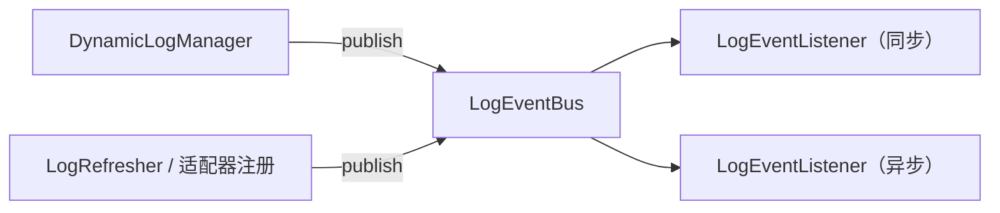

# 事件体系

Dynamic Log 内置一套**实例级事件总线**，在日志级别变更、适配器注册、刷新器启停等关键节点发布事件。业务方可以订阅这些事件，用于审计、埋点、指标采集或触发自定义逻辑，而无需侵入框架核心。



## LogEventBus 事件总线

事件总线负责发布与订阅，`DefaultLogEventBus` 为默认实现：

```java
public interface LogEventBus {
    void publish(LogEvent event);        // 同步发布
    void publishAsync(LogEvent event);   // 异步发布
    void subscribe(LogEventListener listener);
    void unsubscribe(LogEventListener listener);
}
```

事件总线是**实例级**的——每个 `DynamicLogManager` 拥有独立的总线。Spring Boot 环境下由自动配置提供单例 `LogEventBus` Bean，可被自定义 Bean 覆盖。

## EventType 事件类型

`EventType` 枚举覆盖框架的关键节点：

| 事件 | 触发时机 |
|------|----------|
| `LOG_LEVEL_CHANGE` | 即将应用一批日志级别变更（变更前） |
| `LOG_LEVEL_CHANGED` | 日志级别变更应用成功（变更后） |
| `REFRESHER_STARTED` | 刷新器启动 |
| `REFRESHER_STOPPED` | 刷新器停止 |
| `ADAPTER_REGISTERED` | 适配器注册 |
| `ADAPTER_UNREGISTERED` | 适配器注销 |
| `ERROR` | 应用变更等过程中发生异常 |

其中 `LOG_LEVEL_CHANGE` / `LOG_LEVEL_CHANGED` / `ERROR` 由 `DynamicLogManager.applyLogLevelChange` 围绕变更过程发布，`attributes` 中携带 `change`（本次 `LogLevelChange`）与 `adapter`（使用的适配器名），`ERROR` 另带 `error`（异常对象）。

## LogEvent 事件对象

事件对象是不可变的，通过 Builder 构造，用键值 `attributes` 承载上下文：

```java
public final class LogEvent {
    EventType getType();
    Map<String, Object> getAttributes();
    <T> T getAttribute(String key);   // 按类型取属性
    long getTimestamp();
}

// 框架内部发布事件的方式
LogEvent event = LogEvent.builder()
        .type(EventType.LOG_LEVEL_CHANGED)
        .attribute("change", change)
        .attribute("adapter", adapterName)
        .build();
```

## LogEventListener 监听器

实现 `LogEventListener` 即可消费事件，`getOrder()` 控制执行顺序（值越小越先）：

```java
public interface LogEventListener {
    void onEvent(LogEvent event);

    default int getOrder() { return 0; } // 越小越先执行
}
```

订阅示例——记录一条审计日志：

```java
public class AuditLogListener implements LogEventListener {
    private static final Logger audit = LoggerFactory.getLogger("AUDIT");

    @Override
    public void onEvent(LogEvent event) {
        if (event.getType() == EventType.LOG_LEVEL_CHANGED) {
            Object change = event.getAttribute("change");
            String adapter = event.getAttribute("adapter");
            audit.info("日志级别变更 - 适配器: {}, 变更: {}, 时间: {}",
                    adapter, change, event.getTimestamp());
        }
    }

    @Override
    public int getOrder() { return 10; }
}

// 注册到事件总线
manager.getEventBus().subscribe(new AuditLogListener());
```

在 Spring Boot 环境下，通常把订阅逻辑放进[插件](/guide/plugin)的 `start()` 中，通过 `PluginContext.getEventBus()` 拿到总线并订阅，在 `stop()` 中对称退订。

## 完整示例：审计插件

「插件 + 事件监听」的组合用法，官方已沉淀为 `dynamic-log-plugin-audit` 模块——`AuditLogPlugin` 在 `start()` 订阅事件总线，把 `LOG_LEVEL_CHANGED`（及可选的 `ERROR`）写入专用审计 logger（默认 `DYNAMIC-LOG-AUDIT`），在 `stop()` 对称退订：

```java
public class AuditLogPlugin implements DynamicLogPlugin {
    private final Logger auditLog; // 按 dynamic-log.audit.logger-name 解析
    private LogEventBus eventBus;
    private LogEventListener listener;

    @Override public String getPluginId() { return "audit-log-plugin"; }

    @Override public void init(PluginContext ctx) { this.eventBus = ctx.getEventBus(); }

    @Override public void start() {
        this.listener = event -> {
            if (event.getType() == EventType.LOG_LEVEL_CHANGED) {
                auditLog.info("[审计] 日志级别变更已生效 | 适配器={} | 变更明细={}",
                        event.getAttribute("adapter"), event.getAttribute("change"));
            }
        };
        eventBus.subscribe(listener);
    }

    @Override public void stop() { if (eventBus != null && listener != null) eventBus.unsubscribe(listener); }
    @Override public void destroy() { this.eventBus = null; }
}
```

直接引入 `dynamic-log-plugin-audit` 即可开箱使用，无需自己实现；详见 [官方模块与插件 · 审计插件](/guide/plugins-official#审计插件)。

## 下一步

- [插件系统（Plugin SPI）](/guide/plugin)：把事件订阅封装为插件。
- [官方模块与插件](/guide/plugins-official)：官方审计插件与其他能力。
- [核心概念](/guide/concepts)：事件在变更流程中的位置。
