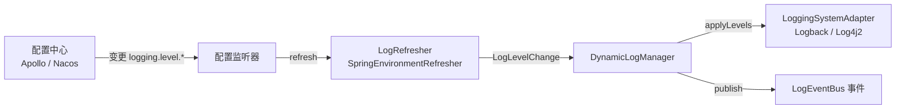

# 简介

**Dynamic Log** 是一款面向 Java 应用的**动态日志级别管理框架**，专为「运行时日志级别调整、配置中心集成、多日志框架适配」而设计。它把日志级别的变更收敛为一次统一的操作：由配置中心（Apollo / Nacos 等）实时下发，框架在**不重启应用**的前提下即时生效，极大提升线上问题排查效率。

## 解决什么问题

线上排查问题时，最需要的往往是「临时把某个包的日志调到 DEBUG，看清楚再调回来」。传统做法要么改配置重启、要么依赖各日志框架自带的、彼此不一致的管理端点。Dynamic Log 把这件事标准化：

- **运行期刷新** —— 通过配置中心在运行时更新日志级别，秒级生效，无需重启应用。
- **统一入口** —— 无论底层是 Logback 还是 Log4j2，都通过同一套 API 与同一份 `logging.level.*` 配置管理。
- **零侵入接入** —— 添加 Apollo / Nacos 客户端依赖即自动注册监听器，业务代码无需感知。
- **可扩展** —— 适配器、刷新器、事件监听器、插件都可自定义，内核保持克制。

## 典型场景

- **线上问题排查**：临时调高指定包的日志级别，拿到详细日志后快速恢复。
- **性能优化**：生产环境动态降低非关键日志级别，减少日志输出对性能的影响。
- **多环境管理**：不同环境使用不同的日志级别策略，通过配置中心统一管理。
- **灰度发布**：灰度期间临时开启详细日志，观察新版本行为。
- **安全审计**：动态开启敏感操作的审计日志，满足合规要求。

## 核心模型

Dynamic Log 的核心只有几件事：把日志系统抽象为**适配器**，把一次级别变更封装为 **LogLevelChange**，由 **DynamicLogManager** 统一应用，并通过**刷新器**对接配置中心。

## 模块一览

核心保持纯净，配置中心与增强能力都拆成**按需引入的独立模块**：

| 模块 | 说明 |
|------|------|
| `dynamic-log-dependencies-bom` | 依赖版本统一管理 BOM |
| `dynamic-log-common` | 公共基础：注解、异常、常量 |
| `dynamic-log-core` | 核心内核，**零 Spring 依赖**：适配器、管理器、事件总线、插件、刷新器 |
| `dynamic-log-spring` | Spring Boot 自动配置、Logback 适配器、`SpringEnvironmentRefresher` |
| `dynamic-log-apollo` | Apollo 配置中心接入（可选） |
| `dynamic-log-nacos` | Nacos 配置中心接入（可选，面向 Spring Cloud Alibaba） |
| `dynamic-log-log4j2` | Log4j2 日志系统适配器（可选） |
| `dynamic-log-plugin-ttl` | 临时调级 + TTL 到期自动回滚（可选） |
| `dynamic-log-endpoint` | 运行期查询/设置级别的 REST 端点（可选） |
| `dynamic-log-plugin-audit` | 级别变更审计日志插件（可选） |
| `dynamic-log-test` | 集成测试用例 |
| `dynamic-log-examples` | 示例应用（`spring-boot-example`） |

## 适用与要求

- **JDK**：编译目标 `1.8`，兼容 Java 8 及以上（全链路已按 JDK 1.8 校准）。
- **Spring**：非必需。核心模块 `dynamic-log-core` 可用于任意 JVM 应用；`dynamic-log-spring` 在 Spring Boot 环境下提供自动装配，配置中心接入由 `dynamic-log-apollo` / `dynamic-log-nacos` 独立模块按需提供。
- **日志系统**：已提供 Logback 与 Log4j2 官方适配器；其他系统可通过实现 `LoggingSystemAdapter` 扩展。

## 下一步

- [快速开始](/guide/quickstart)：在 Spring Boot 项目中跑通最短链路。
- [核心概念](/guide/concepts)：理解适配器、管理器、级别变更模型。
- [动态刷新与配置中心](/guide/refresh)：对接 Apollo / Nacos / Spring Cloud。
- [官方模块与插件](/guide/plugins-official)：Log4j2、TTL、REST 端点、审计。
- [Spring Boot 接入](/guide/springboot)：自动配置与配置项。
