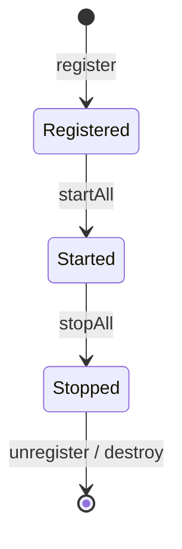

# 插件系统（Plugin SPI）

适配器、刷新器、事件监听、审计等扩展，在 Dynamic Log 中都可以封装为「插件」，由 `PluginManager` 统一注册、装配、启停。插件机制让你无需改动核心代码即可扩展框架能力。

## DynamicLogPlugin 接口

插件模型简洁：一个标识 + 一个版本/顺序 + 一套生命周期方法。

```java
public interface DynamicLogPlugin {
    // 全局唯一标识
    String getPluginId();

    // 插件版本，默认 "1.0.0"
    default String getVersion() { return "1.0.0"; }

    // 执行顺序，越小越先，默认 0
    default int getOrder() { return 0; }

    void init(PluginContext context); // 初始化：读取配置、准备资源
    void start();                     // 启动：注册能力（适配器 / 监听器 ...）
    void stop();                      // 停止：反注册能力、停止异步资源
    void destroy();                   // 销毁：释放资源
}
```

## 生命周期



- **注册即初始化**：`PluginManager.register(plugin)` 会注册并调用 `init`。
- **按序启动**：`startAll()` 按 `getOrder()` 升序依次 `start`。
- **逆序停止**：`stopAll()` 按相反顺序 `stop`（并在注销时 `destroy`），保证依赖关系正确拆解。

## PluginContext：受控入口

插件通过 `init(ctx)` 拿到的 `PluginContext` 访问框架内部，而不直接持有全局状态：

```java
public interface PluginContext {
    LoggingSystemAdapterRegistry getAdapterRegistry(); // 适配器注册表
    LogEventBus getEventBus();                          // 事件总线
    DynamicLogManager getLogManager();                  // 日志管理器
    String getProperty(String key, String defaultValue); // 插件属性
}
```

## PluginManager

`PluginManager` 负责插件的注册、装配与启停：

```java
public interface PluginManager {
    void register(DynamicLogPlugin plugin);   // 注册并 init
    void unregister(String pluginId);         // 注销并 destroy
    void startAll();                          // 按顺序 start 全部
    void stopAll();                           // 逆序 stop 全部
    DynamicLogPlugin getPlugin(String pluginId);
    Collection<DynamicLogPlugin> getPlugins();
    boolean contains(String pluginId);
}
```

## 编写一个插件

以「注册一个自定义刷新器」的插件为例，注意 `start()` 注册的资源要在 `stop()` 中对称清理：

```java
public class PollingRefresherPlugin implements DynamicLogPlugin {

    private LogRefresher refresher;

    @Override public String getPluginId() { return "polling-refresher-plugin"; }

    @Override public int getOrder() { return 50; }

    @Override
    public void init(PluginContext ctx) {
        // 用上下文里的管理器构造刷新器
        this.refresher = new PollingRefresher(ctx.getLogManager());
    }

    @Override
    public void start() {
        refresher.start(); // 对外暴露能力
    }

    @Override
    public void stop() {
        refresher.stop();  // 对称清理
    }

    @Override
    public void destroy() {
        this.refresher = null; // 释放引用
    }
}
```

## Spring Boot 下的自动装配

在 Spring Boot 环境下，**容器中所有 `DynamicLogPlugin` 类型的 Bean 会被自动收集并装配**，无需手写注册：

```java
@Component
public class AuditLogPlugin implements DynamicLogPlugin {
    @Override public String getPluginId() { return "audit-log-plugin"; }
    // init / start / stop / destroy ...
}
```

自动配置的 `DynamicLogPluginLifecycle`（实现 Spring `SmartLifecycle`）在应用启动时按 `getOrder()` 顺序注册并 `startAll`，在应用关闭时 `stopAll`。因此你只需把插件标注为 `@Component` 即可生效。

::: tip 装配顺序
Spring 环境下的收集顺序遵循 `@Order` / `getOrder()`；若插件间存在先后依赖，用 `getOrder()` 显式声明。
:::

## 提交前自检

- `getPluginId()` 返回全局唯一、稳定的标识。
- `start()` 注册的资源（适配器、监听器、刷新器）在 `stop()` 中对称反注册 / 停止。
- `destroy()` 释放全部持有引用（置空、关闭线程池等）。
- 不持有 `DynamicLogManager` 之外的全局可变状态，一律通过 `PluginContext` 访问。

## 下一步

- [事件体系](/guide/events)：插件常用来订阅事件。
- [日志系统适配器](/guide/adapter)：把自定义适配器包装为插件。
- [Spring Boot 接入](/guide/springboot)：插件的自动装配细节。
