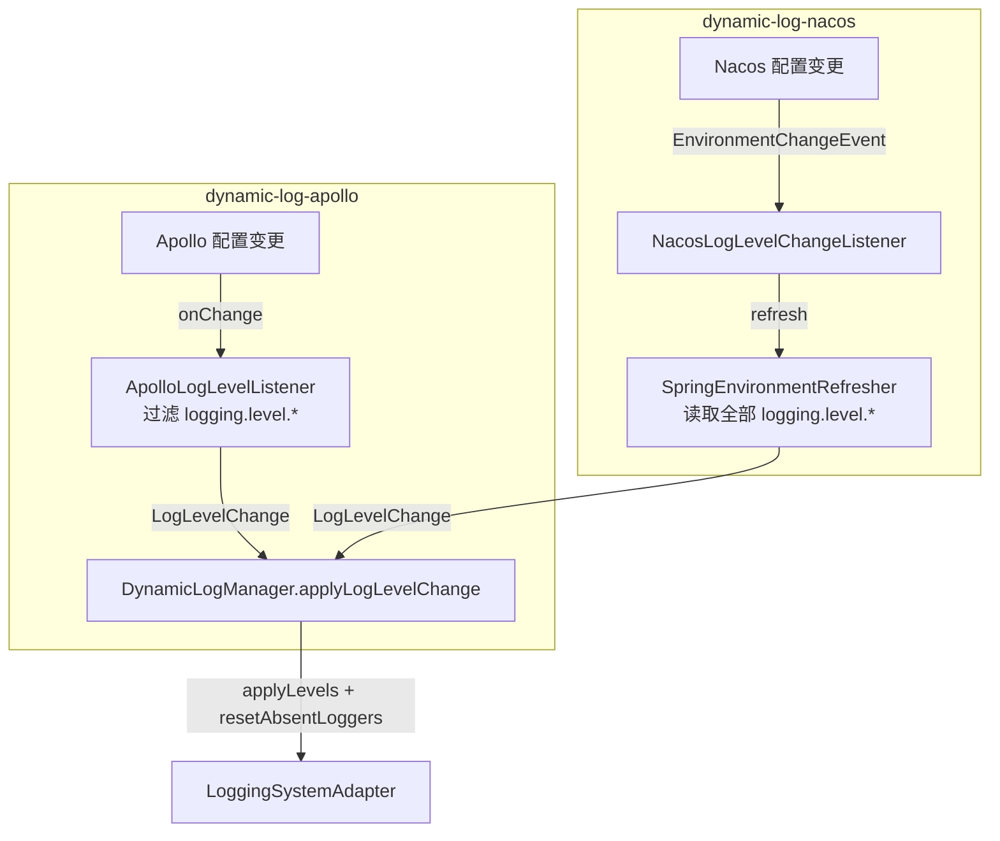

# 动态刷新与配置中心

「运行期刷新日志级别」是 Dynamic Log 的核心能力。配置中心接入被拆分为**按需引入的独立模块**（`dynamic-log-apollo` / `dynamic-log-nacos`），核心与 `dynamic-log-spring` 保持纯净、不携带任何配置中心依赖。本页讲清楚刷新如何触发、如何生效，以及如何对接 Apollo、Nacos、Spring Cloud。

## 两条刷新路径

不同配置中心的接入机制略有差异，但殊途同归——最终都调用适配器应用新级别：



- **Apollo 模块**直接向 Apollo 注册原生监听器，从变更事件中筛出 `logging.level.*` 键，组装 `LogLevelChange` 交给管理器。
- **Nacos 模块**面向 Spring Cloud 标准接入：监听 `EnvironmentChangeEvent`，在 `logging.level.*` 变更时触发 `SpringEnvironmentRefresher` 从 `Environment` 重新读取并应用。

::: tip 为什么整体应用而非增量
`SpringEnvironmentRefresher` 每次都读取完整的 `logging.level.*` 集合并整体应用，`applyLogLevelChange` 内部的 `resetAbsentLoggers` 会复位集合外的 logger。这样「在配置中心删掉某项」也能把该 logger 还原，最终级别始终与配置一致。（Apollo 模块直接消费变更事件，删除键的回退目前暂未处理，见下文说明。）
:::

## Apollo 接入

引入 Apollo 模块 + Apollo 客户端即可，监听器会**自动注册**：

```xml
<dependency>
    <groupId>io.github.xiangganluo</groupId>
    <artifactId>dynamic-log-apollo</artifactId>
    <version>1.0.0</version>
</dependency>
<dependency>
    <groupId>com.ctrip.framework.apollo</groupId>
    <artifactId>apollo-client</artifactId>
</dependency>
```

在 Apollo 配置中心添加日志级别配置：

```properties
logging.level.com.example=DEBUG
logging.level.com.example.service=INFO
```

工作机制：`ApolloDynamicLogAutoConfiguration` 在所有单例初始化完成后，把 `ApolloLogLevelListener` 注册到 Apollo 默认命名空间（`ConfigService.getAppConfig().addChangeListener`）以及配置的额外命名空间。监听器在 `onChange` 中筛出以 `logging.level.` 开头的变更键，转成 `LogLevelChange` 并 `applyLogLevelChange`。

配置项（前缀 `dynamic-log.apollo`）：

| 配置项 | 类型 | 默认值 | 说明 |
|--------|------|--------|------|
| `dynamic-log.apollo.enabled` | boolean | `true` | 是否启用 Apollo 集成 |
| `dynamic-log.apollo.namespaces` | List | `[application]` | 额外监听的命名空间（`application` 已默认注册，会自动去重） |

```yaml
dynamic-log:
  apollo:
    enabled: true
    namespaces:
      - application
      - some-other-namespace
```

::: warning 删除键的处理
Apollo 监听器目前对「删除型变更」（新值为空的 DELETED 键）暂作忽略——因为单次变更事件只是「变更子集」而非完整配置视图，无法安全地推断被删除键应回退到的级别。需要「删除即还原」语义时，可改用 Nacos（走 Environment 全量重读）或[手动/编程式刷新](#手动触发刷新)。
:::

## Nacos 接入

引入 Nacos 模块 + Spring Cloud Alibaba Nacos Config，监听器同样**自动注册**：

```xml
<dependency>
    <groupId>io.github.xiangganluo</groupId>
    <artifactId>dynamic-log-nacos</artifactId>
    <version>1.0.0</version>
</dependency>
<dependency>
    <groupId>com.alibaba.cloud</groupId>
    <artifactId>spring-cloud-starter-alibaba-nacos-config</artifactId>
</dependency>
```

在 Nacos 配置中心添加日志级别配置：

```yaml
logging:
  level:
    com.example: DEBUG
    com.example.service: WARN
```

工作机制：Nacos Config 变更会刷新 Spring `Environment` 并发布 `EnvironmentChangeEvent`；`NacosLogLevelChangeListener` 检测到变更键中包含 `logging.level.*` 时，触发 `SpringEnvironmentRefresher.refresh()` 从 `Environment` 重新读取并整体应用。因此无需直接依赖 Nacos SDK 的原生监听器，复用 Spring Cloud 的配置刷新机制即可。

配置项（前缀 `dynamic-log.nacos`）：

| 配置项 | 类型 | 默认值 | 说明 |
|--------|------|--------|------|
| `dynamic-log.nacos.enabled` | boolean | `true` | 是否启用 Nacos 集成 |

::: info 生效条件
Nacos 模块仅当 classpath 同时存在 Nacos（`com.alibaba.nacos.api.config.listener.Listener`）与 Spring Cloud Context（`EnvironmentChangeEvent`）、容器中存在 `SpringEnvironmentRefresher`，且 `dynamic-log.nacos.enabled` 未显式关闭时装配。
:::

## 其他 Spring Cloud 配置源

`SpringEnvironmentRefresher` 由 `dynamic-log-spring` 自动提供。若你的配置来源会发布 `EnvironmentChangeEvent`（例如自建的 Spring Cloud Config），可参照 Nacos 模块的思路，自行监听事件并触发刷新：

```java
@Component
public class LogRefreshListener {

    @Autowired
    private SpringEnvironmentRefresher refresher;

    @EventListener
    public void onEnvironmentChange(EnvironmentChangeEvent event) {
        boolean loggingChanged = event.getKeys().stream()
                .anyMatch(key -> key.startsWith("logging.level"));
        if (loggingChanged) {
            refresher.refresh();
        }
    }
}
```

> 需要 `EnvironmentChangeEvent` 时请自行引入 `spring-cloud-context`（Nacos Config Starter 已传递引入）。

## 手动触发刷新

任意持有 `SpringEnvironmentRefresher`（或自定义 `LogRefresher`）的地方都可主动刷新一次。若只想通过 HTTP 查询/设置级别，推荐直接使用官方 [dynamic-log-endpoint](/guide/plugins-official#rest-端点) 模块：

```java
@RestController
@RequestMapping("/internal/log")
public class LogAdminController {

    @Autowired
    private SpringEnvironmentRefresher refresher;

    @PostMapping("/refresh")
    public String refresh() {
        refresher.refresh();
        return "ok";
    }
}
```

## 编程式刷新（不依赖配置中心）

也可以完全绕开刷新器，直接用 `DynamicLogManager` 应用一次变更：

```java
LogLevelChange change = LogLevelChange.builder()
        .putLevel("com.example", "DEBUG")
        .build();
manager.applyLogLevelChange(change);

// 全部复位（ROOT 除外）
manager.resetAllLogLevels();
```

需要「临时调级、到期自动回滚」时，见官方 [TTL 插件](/guide/plugins-official#临时调级与自动回滚)。

## 下一步

- [核心概念](/guide/concepts)：`LogLevelChange` 与管理器的应用语义。
- [官方模块与插件](/guide/plugins-official)：Log4j2、TTL、REST 端点、审计。
- [Spring Boot 接入](/guide/springboot)：刷新器的自动装配。
- [事件体系](/guide/events)：订阅刷新前后的事件。
