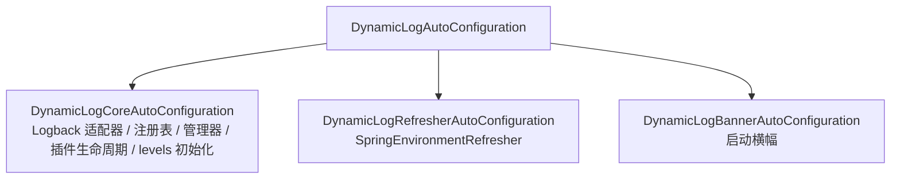

# Spring Boot 接入

`dynamic-log-spring` 在 Spring Boot 环境下**真正开箱即用**：自动注册 Logback 适配器、创建 `DynamicLogManager` 与 `SpringEnvironmentRefresher`、装配插件，并在启动时以 additive 方式应用 `dynamic-log.levels`。配置中心接入已拆分为独立模块（`dynamic-log-apollo` / `dynamic-log-nacos`），按需引入，详见 [动态刷新与配置中心](/guide/refresh)。

## 引入依赖

```xml
<dependency>
    <groupId>io.github.xiangganluo</groupId>
    <artifactId>dynamic-log-spring</artifactId>
    <version>1.0.0</version>
</dependency>
```

引入后即触发自动配置，无需任何 `@EnableXxx` 注解。

## 自动配置做了什么

主入口 `DynamicLogAutoConfiguration` 导入三个子配置，实现细粒度的条件控制：



- **默认适配器**（`DynamicLogCoreAutoConfiguration`，受 `dynamic-log.enabled` 控制，默认启用）：当容器中没有其他 `LoggingSystemAdapter` Bean 时，自动注册 `LogbackSpringAdapter`（名 `logback`）。这解决了此前「Spring 下未注册任何适配器、应用变更即抛异常」的问题。
- **适配器注册表**：通过 `ObjectProvider<LoggingSystemAdapter>` 收集容器中**所有** `LoggingSystemAdapter` Bean 并注册；第一个为默认，可由 `dynamic-log.default-adapter` 覆盖。引入 [dynamic-log-log4j2](/guide/plugins-official#log4j2-适配器) 即自动加入 Log4j2 适配器。
- **管理器 / 事件总线 / 插件管理器**：创建 `DynamicLogManager`、`LogEventBus`、`PluginManager`，均带 `@ConditionalOnMissingBean`，可被自定义 Bean 覆盖。
- **插件生命周期**：`DynamicLogPluginLifecycle`（`SmartLifecycle`）自动收集容器中所有 `DynamicLogPlugin` Bean，启动时按序注册并 `startAll`，关闭时 `stopAll`。
- **levels 初始化**：一个 `ApplicationRunner` 在启动时以 **additive** 方式（`adapter.applyLevels`）应用 `dynamic-log.levels`——逐条设置、**不** 走 `applyLogLevelChange`，因而不会用 `resetAbsentLoggers` 冲掉 Spring Boot 已配置好的 `logging.level.*`。
- **刷新器**（`DynamicLogRefresherAutoConfiguration`）：创建 `SpringEnvironmentRefresher` 并在启动时 `start()`。
- **启动横幅**（`DynamicLogBannerAutoConfiguration`）：受 `banner-enabled` 控制。

配置中心接入不在此列——Apollo / Nacos 已拆为独立模块，见 [动态刷新与配置中心](/guide/refresh)。

## 配置项

配置写在 `application.yml` / `application.properties`，前缀 `dynamic-log`：

| 配置项 | 类型 | 默认值 | 说明 |
|--------|------|--------|------|
| `dynamic-log.enabled` | boolean | `true` | 是否启用 Dynamic Log 框架 |
| `dynamic-log.banner-enabled` | boolean | `true` | 启动时是否打印横幅 |
| `dynamic-log.default-adapter` | string | `logback` | 默认日志适配器名称 |
| `dynamic-log.levels` | Map | - | 预置日志级别（logger 名 → 级别） |

```yaml
dynamic-log:
  enabled: true
  banner-enabled: true
  default-adapter: logback
  levels:
    com.example: INFO
    com.example.service: INFO
```

::: tip levels 与 logging.level.* 的关系
`dynamic-log.levels` 在启动时以 additive 方式应用（不会复位其他 logger），用于框架维度预置一批级别；运行期由配置中心下发的变更走标准的 `logging.level.*`，经 `SpringEnvironmentRefresher` 整体读取并应用（会复位集合外 logger）。二者互不冲突。
:::

除上表外，各官方模块还提供各自的 `dynamic-log.<name>.*` 配置项（`apollo` / `nacos` / `log4j2` / `ttl` / `endpoint` / `audit`），详见 [动态刷新与配置中心](/guide/refresh) 与 [官方模块与插件](/guide/plugins-official)。

## 覆盖默认组件

所有核心 Bean 都是 `@ConditionalOnMissingBean`，声明同类型 Bean 即可覆盖默认实现。例如替换事件总线或注册自定义适配器：

```java
@Configuration
public class MyDynamicLogConfig {

    // 覆盖默认事件总线
    @Bean
    public LogEventBus logEventBus() {
        return new MyLogEventBus();
    }

    // 追加一个自定义适配器（会被 ObjectProvider 收集并注册进注册表）
    @Bean
    public LoggingSystemAdapter myAdapter() {
        return new MyLoggingSystemAdapter();
    }
}
```

::: tip
注册表通过 `ObjectProvider<LoggingSystemAdapter>` 收集**所有**适配器 Bean。注意默认的 Logback 适配器带 `@ConditionalOnMissingBean(LoggingSystemAdapter.class)`——一旦容器中出现任意适配器 Bean（例如引入 log4j2 模块），默认 Logback 适配器就不再注册；需要并存时请自行显式声明 `LogbackSpringAdapter` Bean。
:::

## 添加插件

把插件标注为 `@Component`，即被 `DynamicLogPluginLifecycle` 自动收集装配：

```java
@Component
public class AuditLogPlugin implements DynamicLogPlugin {
    @Override public String getPluginId() { return "audit-log-plugin"; }
    @Override public void init(PluginContext ctx) { /* ... */ }
    @Override public void start() { /* 订阅事件 / 注册能力 */ }
    @Override public void stop() {}
    @Override public void destroy() {}
}
```

详见 [插件系统](/guide/plugin)。

## 完整链路小结

1. 引入 `dynamic-log-spring`（可选：`dynamic-log-dependencies-bom` 统一版本）。
2. 按需引入配置中心模块（`dynamic-log-apollo` / `dynamic-log-nacos`）+ 对应客户端，监听器随之自动注册。
3. 在 `application.yml` 配置 `dynamic-log.*`（通常全用默认即可）。
4. 在配置中心用 `logging.level.*` 调整级别，运行期即时生效。
5. 按需引入官方模块（`log4j2` / `ttl` / `endpoint` / `audit`），或用 `@Component` 暴露自定义适配器 / 插件。

完整可运行示例见仓库 `dynamic-log-examples/spring-boot-example` 模块。
